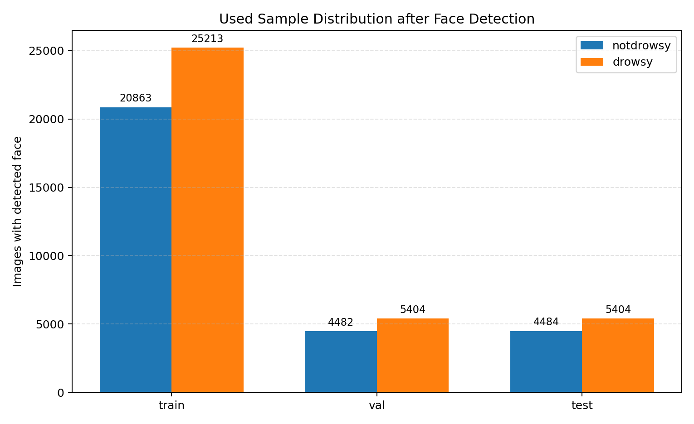
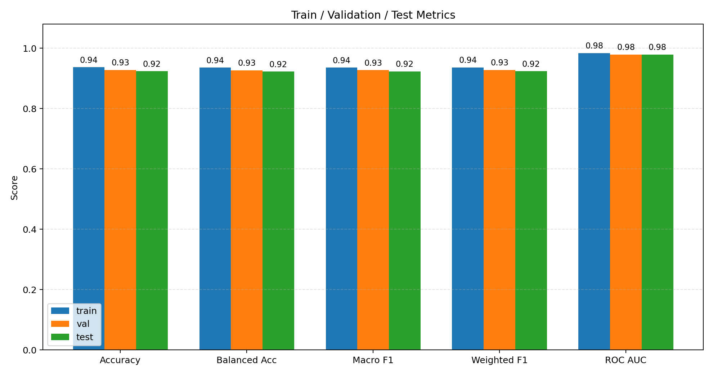
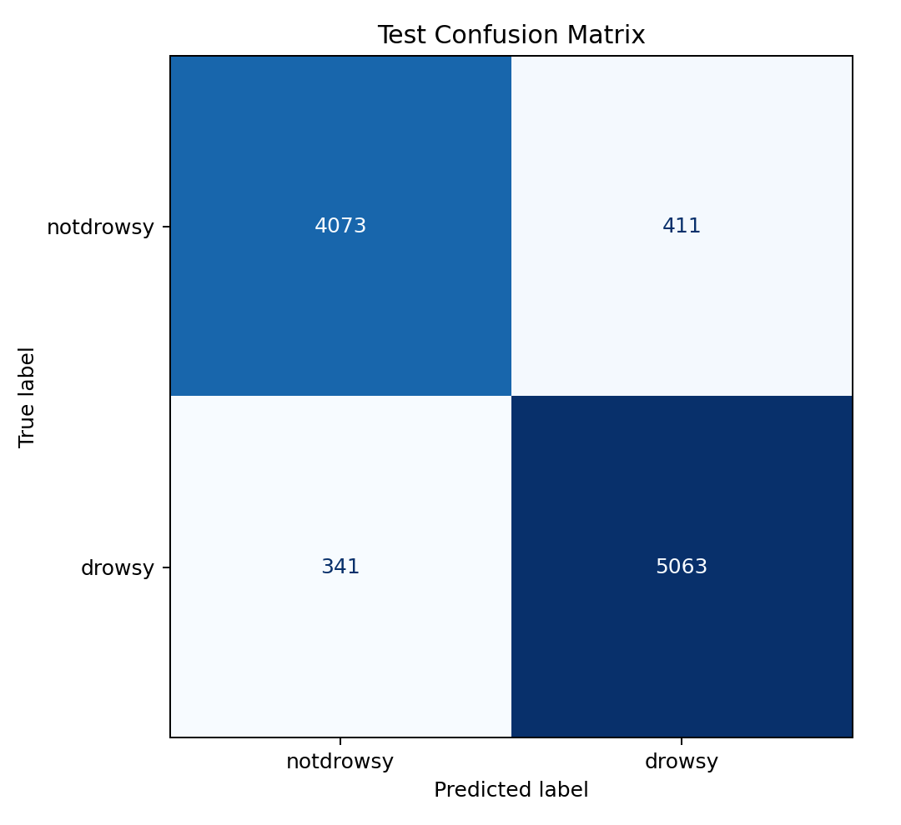
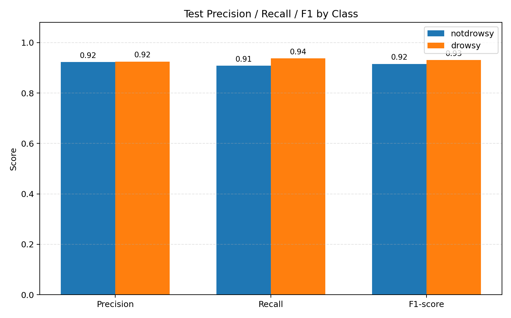
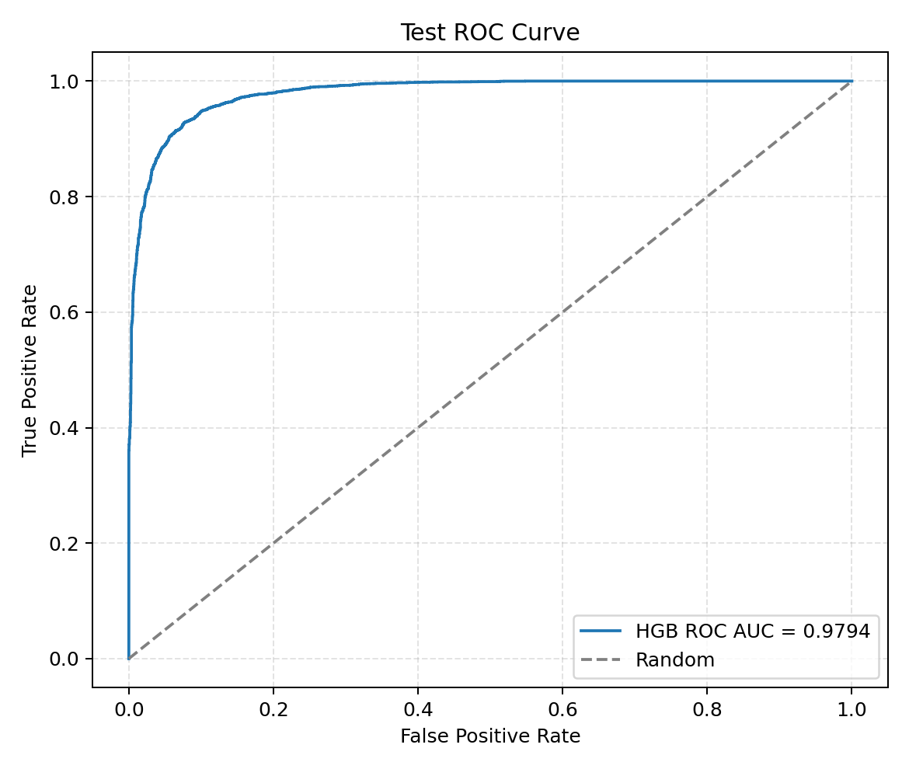

# 驾驶员疲劳检测项目报告

## 1. 项目概述

本项目面向驾驶员疲劳状态的图像二分类任务，目标是根据驾驶员面部图像判断其是否处于疲劳/困倦状态。项目中的类别标签分为两类：`notdrowsy` 表示清醒或非疲劳状态，标签为 0；`drowsy` 表示疲劳或困倦状态，标签为 1。数据集已经被划分为训练集、验证集和测试集，目录结构为 `dataset_split/train`、`dataset_split/val` 和 `dataset_split/test`。

本项目并没有直接训练 CNN、RNN、Transformer 等端到端深度学习模型，而是采用“人脸关键点检测 + 人工特征提取 + 传统机器学习分类器”的方案。具体来说，首先使用 MediaPipe Face Mesh 对图像中的人脸进行关键点定位，然后根据眼睛、嘴部、眉眼关系、人脸几何形状和图像质量等信息构造特征向量，最后使用传统机器学习分类器完成疲劳状态预测。

仓库中包含两个版本：

- `DriverFatigueDetection-v0`：基线版本，主要使用 EAR（Eye Aspect Ratio，眼睛纵横比）和 MAR（Mouth Aspect Ratio，嘴部纵横比）等少量特征，包含规则阈值法和 SVM 分类器两种方案。
- `DriverFatigueDetection-v1`：改进版本，在 v0 的基础上扩展到 35 个手工特征，并使用 `HistGradientBoostingClassifier` 作为最终分类器。该版本在当前测试集上取得了更高的分类准确率，因此本报告主要围绕 v1 方法展开。

## 2. 使用的方法与模型概述

本项目最终采用的方案可以概括为以下流程：

1. **图像读取与预处理**：读取驾驶员面部图像，并计算亮度、对比度、模糊度等图像质量信息。
2. **人脸关键点检测**：使用 MediaPipe Face Mesh 检测人脸关键点。Face Mesh 可以输出较密集的人脸 landmarks，为后续计算眼睛、嘴部、眉毛、鼻尖、下巴等区域的几何关系提供基础。
3. **人工特征构造**：根据关键点坐标计算 35 维特征，包括眼睛开合、嘴部开合、人脸宽高比、头部姿态代理特征、眉眼距离和图像质量特征等。
4. **缺失值处理**：使用 `SimpleImputer(strategy="median")` 对可能出现的缺失值进行中位数填充。
5. **分类模型训练**：使用 `HistGradientBoostingClassifier` 训练二分类模型，输出 `notdrowsy` 或 `drowsy`。
6. **模型评估**：在训练集、验证集、测试集上计算准确率、平衡准确率、F1、ROC AUC、混淆矩阵和分类报告。

选择该方法的原因如下：

- **可解释性较强**：相比端到端深度学习模型，EAR、MAR、人脸宽高比、眉眼距离等特征具有比较明确的生理或几何含义。例如，疲劳时可能出现眼睛闭合程度增加、嘴部张开打哈欠、面部姿态变化等现象。
- **训练成本较低**：传统机器学习模型不需要大量 GPU 资源，训练和推理成本相对较低，适合课程实践和 baseline 对比。
- **对中小规模数据较友好**：在特征设计合理的情况下，梯度提升树模型能够较好地处理非线性关系，并且对特征缩放要求不高。
- **性能优于简单规则**：规则阈值方法只能根据固定阈值进行判断，难以适应不同驾驶员、不同拍摄角度和不同光照条件；而梯度提升树可以从数据中学习多特征组合关系，因此在测试集上明显优于 v0 规则阈值和 v0 SVM。

需要说明的是，MediaPipe 在本项目中只用于人脸关键点提取，并不是本项目训练出的分类模型。最终训练的疲劳识别模型仍然是 scikit-learn 中的传统机器学习分类器。

## 3. 特征设计

v1 版本使用固定的 35 维特征，特征 schema 版本为 `v1_feature_schema_001`。这些特征大致可以分为以下几类。

### 3.1 眼睛开合特征

眼睛状态是疲劳检测中最常见、最重要的信息之一。项目计算了左右眼 EAR、平均 EAR、最小 EAR、最大 EAR、左右眼差异和左右眼比例等特征。通常情况下，疲劳或困倦状态可能伴随眼睛开合程度降低、闭眼时间增加或双眼状态不对称等现象。

相关特征包括：

- `ear_left`
- `ear_right`
- `ear_mean`
- `ear_min`
- `ear_max`
- `ear_diff_abs`
- `ear_ratio_left_right`
- `left_eye_width_norm`
- `right_eye_width_norm`
- `left_eye_height_norm`
- `right_eye_height_norm`

### 3.2 嘴部开合特征

驾驶员疲劳时可能出现打哈欠等现象，因此嘴部开合程度也是重要特征。项目计算了 MAR、嘴部宽度、嘴部高度、嘴部开合面积代理值、嘴部与人脸宽度比例，以及 MAR 与 EAR 的组合关系。

相关特征包括：

- `mar`
- `mouth_width_norm`
- `mouth_height_norm`
- `mouth_open_area_proxy`
- `mouth_to_face_width`
- `mar_to_ear_mean`
- `mar_minus_ear_mean`

### 3.3 人脸几何与头部姿态代理特征

疲劳状态下，驾驶员可能出现低头、偏头或姿态变化。项目没有直接进行三维头姿估计，而是通过二维关键点之间的相对位置关系构造头部姿态代理特征，例如鼻尖位置、鼻尖到下巴距离、额头到下巴距离、左右脸宽比例、眼线角度和嘴线角度等。

相关特征包括：

- `face_width`
- `face_height`
- `face_aspect_ratio`
- `nose_x_norm`
- `nose_y_norm`
- `nose_to_chin_norm`
- `forehead_to_chin_norm`
- `left_right_face_width_ratio`
- `eye_line_angle`
- `mouth_line_angle`

### 3.4 眉眼距离特征

眉毛和眼睛之间的距离可以反映一定的面部状态变化。项目计算左右眉眼距离、平均眉眼距离以及左右差异，用于辅助判断疲劳状态。

相关特征包括：

- `left_brow_eye_distance_norm`
- `right_brow_eye_distance_norm`
- `brow_eye_distance_mean`
- `brow_eye_distance_diff_abs`

### 3.5 图像质量特征

实际图像中可能存在亮度不足、对比度较低、模糊等情况，这些因素会影响关键点检测和分类结果。v1 将亮度、对比度和模糊度也作为特征输入模型，使分类器能够一定程度上感知图像质量。

相关特征包括：

- `brightness`
- `contrast`
- `blur_score`

## 4. 训练设置与超参数

本报告使用 v1 版本的特征和模型配置进行训练。由于当前可用 Python/MediaPipe 环境中无法稳定运行 legacy `mp.solutions.face_mesh.FaceMesh` 接口，本次报告中的分类器训练没有重新运行 MediaPipe 特征提取，而是使用项目已经生成并缓存的 MediaPipe 特征矩阵进行重新训练。也就是说，本次报告确实重新训练了最终的传统机器学习分类器，但特征提取阶段使用的是已有缓存特征。

训练使用的模型管线如下：

```text
SimpleImputer(strategy="median") + HistGradientBoostingClassifier
```

主要超参数如下：

| 参数 | 取值 | 说明 |
|---|---:|---|
| 特征数量 | 35 | v1 手工特征数量 |
| 特征 schema | `v1_feature_schema_001` | 用于保证训练、评估、预测时特征顺序一致 |
| 缺失值处理 | `SimpleImputer(strategy="median")` | 使用中位数填充缺失特征 |
| 分类器 | `HistGradientBoostingClassifier` | 直方图梯度提升树分类器 |
| `max_iter` | 250 | 最大 boosting 迭代次数 |
| `learning_rate` | 0.05 | 学习率 |
| `max_leaf_nodes` | 15 | 每棵树最大叶子节点数 |
| `l2_regularization` | 0.01 | L2 正则化强度 |
| `early_stopping` | true | 启用早停机制 |
| `validation_fraction` | 0.15 | 分类器内部早停验证比例 |
| `random_state` | 42 | 随机种子 |
| 类别权重 | balanced sample weights | 训练时使用 `compute_sample_weight(class_weight="balanced")` 平衡类别权重 |

本次训练得到的分类器实际迭代次数为 250，早停机制处于启用状态。

## 5. 数据集与样本使用情况

在使用 MediaPipe 特征时，部分图片可能因为未检测到人脸而无法提取有效特征。这些图片不会参与最终分类器训练或评估。各数据划分中的样本使用情况如下表所示。

| 数据划分 | 原始样本数 | 有效样本数 | 未检测到人脸样本数 |
|---|---:|---:|---:|
| 训练集 | 46,564 | 46,076 | 488 |
| 验证集 | 9,977 | 9,886 | 91 |
| 测试集 | 9,980 | 9,888 | 92 |

数据集有效样本分布如下图所示。



## 6. 训练与验证结果

本次重新训练后，在训练集、验证集和测试集上的整体指标如下。

| 数据划分 | Accuracy | Balanced Accuracy | Macro F1 | Weighted F1 | ROC AUC |
|---|---:|---:|---:|---:|---:|
| 训练集 | 0.9368 | 0.9357 | 0.9361 | 0.9367 | 0.9842 |
| 验证集 | 0.9280 | 0.9267 | 0.9272 | 0.9279 | 0.9792 |
| 测试集 | 0.9239 | 0.9226 | 0.9232 | 0.9239 | 0.9794 |

从结果看，训练集准确率为 93.68%，验证集准确率为 92.80%，测试集准确率为 92.39%。训练集与验证集、测试集之间存在一定差距，但差距不大，说明模型没有出现非常严重的过拟合。ROC AUC 在训练集、验证集和测试集上均接近 0.98，说明模型对两类样本具有较强的区分能力。

训练、验证、测试指标对比如下图所示。



### 6.1 训练集结果

训练集有效样本数为 46,076，混淆矩阵如下：

| 真实类别 / 预测类别 | notdrowsy | drowsy |
|---|---:|---:|
| notdrowsy | 19,275 | 1,588 |
| drowsy | 1,325 | 23,888 |

训练集分类报告：

| 类别 | Precision | Recall | F1-score | Support |
|---|---:|---:|---:|---:|
| notdrowsy | 0.9357 | 0.9239 | 0.9297 | 20,863 |
| drowsy | 0.9377 | 0.9474 | 0.9425 | 25,213 |

### 6.2 验证集结果

验证集有效样本数为 9,886，混淆矩阵如下：

| 真实类别 / 预测类别 | notdrowsy | drowsy |
|---|---:|---:|
| notdrowsy | 4,092 | 390 |
| drowsy | 322 | 5,082 |

验证集分类报告：

| 类别 | Precision | Recall | F1-score | Support |
|---|---:|---:|---:|---:|
| notdrowsy | 0.9271 | 0.9130 | 0.9200 | 4,482 |
| drowsy | 0.9287 | 0.9404 | 0.9345 | 5,404 |

验证集上，`drowsy` 类召回率为 0.9404，高于 `notdrowsy` 类召回率 0.9130，说明模型对疲劳类样本具有较强识别能力，但也会将一部分清醒样本误判为疲劳。

## 7. 测试集结果与分析

测试集有效样本数为 9,888，整体准确率为 0.9239，ROC AUC 为 0.9794。测试集混淆矩阵如下。

| 真实类别 / 预测类别 | notdrowsy | drowsy |
|---|---:|---:|
| notdrowsy | 4,073 | 411 |
| drowsy | 341 | 5,063 |

其中：

- 真实为 `notdrowsy` 且预测正确的样本为 4,073 张；
- 真实为 `notdrowsy` 但误判为 `drowsy` 的样本为 411 张；
- 真实为 `drowsy` 但误判为 `notdrowsy` 的样本为 341 张；
- 真实为 `drowsy` 且预测正确的样本为 5,063 张。

测试集混淆矩阵图如下。



测试集分类报告如下。

| 类别 | Precision | Recall | F1-score | Support |
|---|---:|---:|---:|---:|
| notdrowsy | 0.9227 | 0.9083 | 0.9155 | 4,484 |
| drowsy | 0.9249 | 0.9369 | 0.9309 | 5,404 |

测试集各类别 precision、recall 和 F1-score 对比如下图所示。



从测试集结果可以看出，模型对 `drowsy` 类的召回率为 0.9369，说明大部分疲劳样本可以被成功识别；对 `notdrowsy` 类的召回率为 0.9083，说明仍有部分清醒样本被误判为疲劳。对于驾驶员疲劳检测任务而言，将疲劳样本漏判为清醒通常比将清醒样本误判为疲劳更危险，因此当前模型在疲劳类召回率较高这一点上具有一定优势。

测试集 ROC 曲线如下图所示。



ROC AUC 达到 0.9794，说明模型输出的疲劳概率具有较好的排序能力。即使在不同阈值下调整误报率和漏报率，模型整体仍能保持较强的类别区分效果。

## 8. 与 v0 基线方法对比

为了说明改进版本的效果，将 v1 与 v0 中的两种基线方法进行比较。当前测试集共有 9,980 张图片，其中 9,888 张检测到人脸并参与有效评估。测试集准确率如下。

| 版本 | 方法 | 特征数量/类型 | 测试集准确率 |
|---|---|---|---:|
| v0 | 规则阈值法 | EAR/MAR 阈值 | 59.74% |
| v0 | SVM | 4 个 EAR/MAR 特征 | 68.72% |
| v1 | HistGradientBoosting | 35 个手工特征 | 92.39% |

相比 v0 规则阈值法，v1 的准确率提升约 32.65 个百分点；相比 v0 SVM，v1 的准确率提升约 23.19 个百分点。性能提升主要来自两个方面：

1. **特征更丰富**：v0 主要依赖 EAR/MAR，能够描述眼睛和嘴部开合，但无法充分利用人脸姿态、眉眼关系和图像质量等信息。v1 增加到 35 维特征，使模型可以综合多种线索进行判断。
2. **模型表达能力更强**：规则阈值方法只能表达简单的线性或阈值逻辑；SVM 虽然比规则法更灵活，但输入特征较少。HistGradientBoosting 能够学习多特征之间的非线性组合关系，因此更适合当前任务。

## 9. 训练产物与图表说明

本次报告生成的主要文件包括：

- `report_metrics.json`：本次重新训练和评估得到的指标结果。
- `hgb_fatigue_report.joblib`：本次报告重新训练得到的分类器模型文件。
- `report_figures.json`：图表路径索引。
- `figures/dataset_distribution.png`：数据集分布图。
- `figures/metric_comparison.png`：训练集、验证集、测试集指标对比图。
- `figures/test_confusion_matrix.png`：测试集混淆矩阵图。
- `figures/test_class_metrics.png`：测试集分类指标图。
- `figures/test_roc_curve.png`：测试集 ROC 曲线图。

这些图表均由 matplotlib 生成，并已嵌入到本报告中。

## 10. 总结与不足

本项目使用 MediaPipe Face Mesh 提取人脸关键点，并基于关键点构造眼睛、嘴部、人脸几何、眉眼距离和图像质量等 35 维手工特征。最终使用 `SimpleImputer(strategy="median") + HistGradientBoostingClassifier` 作为疲劳状态二分类模型。在本次重新训练和评估中，模型在验证集上达到 92.80% 的准确率，在测试集上达到 92.39% 的准确率，测试集 ROC AUC 达到 0.9794，明显优于 v0 中的规则阈值法和 SVM 基线方法。

该方法的优点是训练成本低、特征含义清晰、模型效果较好，适合课程实践和传统机器学习 baseline 对比。但项目仍存在一些不足：

1. **依赖人脸关键点检测质量**：如果图像中人脸遮挡严重、光照较差、头部角度过大，MediaPipe 可能无法检测到人脸，导致样本被跳过或预测为 unknown。
2. **可能存在数据划分乐观性**：如果相邻帧、同一驾驶员或同一视频片段同时出现在训练集、验证集和测试集中，测试准确率可能偏高，不能完全代表跨驾驶员、跨场景泛化能力。
3. **缺少时间序列信息**：疲劳状态通常与连续闭眼时间、打哈欠持续时间等时序特征有关，而当前模型基于单张图像进行判断，没有使用视频连续帧信息。
4. **不是完整车载安全系统**：实际车载疲劳检测还需要考虑实时性、摄像头稳定性、误报处理、报警策略、夜间红外图像和不同驾驶员个体差异等问题。

后续可以考虑在保持可解释性的基础上加入视频序列统计特征，例如 PERCLOS、连续闭眼帧数、连续打哈欠检测、短时间窗口内的预测平滑等，从而进一步提升疲劳检测系统的稳定性和实用性。
